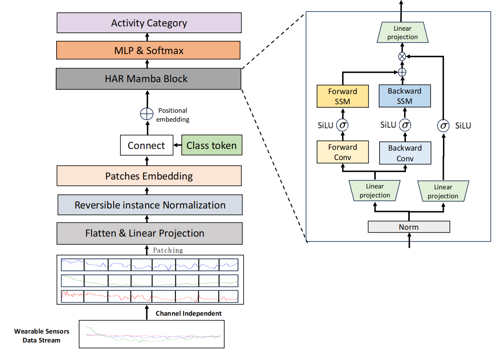

<div align="left">
<h1>HARMamba</h1>
<h3>Efficient and Lightweight Wearable Sensor Human Activity Recognition Based on Bidirectional Mamba</h3>


Paper: [HARMamba: Efficient and Lightweight Wearable Sensor Human Activity Recognition Based on Bidirectional Mamba](https://arxiv.org/abs/2403.20183)


## Abstract
<div align="left">
Wearable sensor-based human activity recognition (HAR) is a critical research domain in activity perception. However, achieving high efficiency and long sequence recognition remains a challenge. Despite the extensive investigation of temporal deep learning models, such as CNNs, RNNs, and transformers, their extensive parameters often pose significant computational and memory constraints, rendering them less suitable for resource-constrained mobile health applications. This study introduces HARMamba, an innovative light-weight and versatile HAR architecture that combines selective bidirectional State Spaces Model and hardware-aware design. To optimize real-time resource consumption in practical scenarios, HARMamba employs linear recursive mechanisms and parameter discretization, allowing it to selectively focus on relevant input sequences while efficiently fusing scan and recompute operations. The model employs independent channels to process sensor data streams, dividing each channel into patches and appending classification tokens to the end of the sequence. It utilizes position embedding to represent the sequence order. The patch sequence is subsequently processed by HARMamba Block, and the classification head finally outputs the activity category. The HARMamba Block serves as the fundamental component of the HARMamba architecture, enabling the effective capture of more discriminative activity sequence features. HARMamba outperforms contemporary state-of-the-art frameworks, delivering comparable or better accuracy with significantly reducing computational and memory demands. It's effectiveness has been extensively validated on 4 publically available datasets namely PAMAP2, WISDM, UNIMIB SHAR and UCI. The F1 scores of HARMamba on the four datasets are 99.74%, 99.20%,   88.23% and 97.01%, respectively.
</div>

## Overview
<div >

</div>

## Env Prepare
<div align="left">


- Python 3.9
  - `conda create -n your_env_name python=3.9`
- Requirements: requirements.txt
  - `pip install -r requirements.txt`
- Install ``causal_conv1d`` and ``mamba``
  - `pip install -e causal_conv1d>=1.1.0`
  - `pip install -e mamba-1p1p1`
</div>

  


## Acknowledgement :heart:
<div align="left">

This project is based on Mamba ([paper](https://arxiv.org/abs/2312.00752), [code](https://github.com/state-spaces/mamba)), Causal-Conv1d ([code](https://github.com/Dao-AILab/causal-conv1d)). Thanks for their wonderful works.

We appreciate the following GitHub repos a lot for their valuable code and efforts.

- Mamba（https://github.com/state-spaces/mamba)）
- Causal-Conv1d (https://github.com/Dao-AILab/causal-conv1d)](https://github.com/Dao-AILab/causal-conv1d)
- PatchTST（https://github.com/yuqinie98/PatchTST）
- Vision Mamba(https://github.com/hustvl/Vim)
</div>

## Citation
<div align="left">
If you find this repo helpful, please cite our paper.

```bibtex
@article{li2024harmamba,
  title={HARMamba: Efficient and Lightweight Wearable Sensor Human Activity Recognition Based on Bidirectional Mamba},
  author={Li, Shuangjian and Zhu, Tao and Duan, Furong and Chen, Liming and Ning, Huansheng and Nugent, Christopher and Wan, Yaping},
  journal={IEEE Internet of Things Journal},
  year={2024},
  publisher={IEEE}
}
```
</div>
